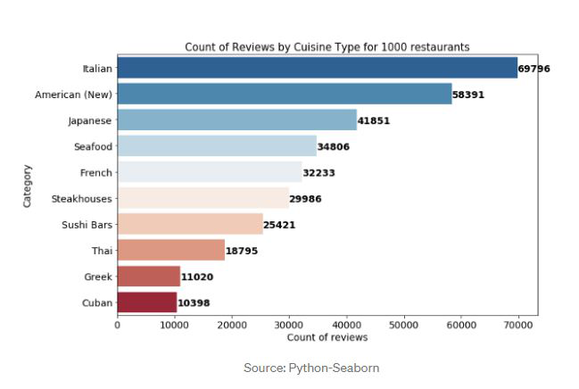

# Welcome to the Sentiment Analysis of Yelp reviews - Seabass Edition

## Background

Data is more powerful when we share it with others! Let's take what we've learned about HTML and CSS to create a dashboard showing off the analysis.

#### Landing page

Large screen:
)

Small screen:



