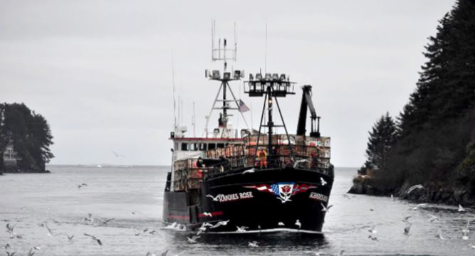

# Welcome to the Sentiment Analysis of Yelp reviews - Seabass Edition

## Yelp reviews - Customer Reviews Analysis Dashboard with Seabass

The purpose of the tool is to gauge the popularity of seabass in different cuisines and restaurants 

## Technologies
* Python, Matplotlib, Beautiful Soup, Seaborn, NLTK
* PostgreSQL for Database
* Tableau

## Features
* Natural Language Toolkit to show ratings of subjective, difficult, readability, unique words
* Insights on how Seafood customers behavior patterns
* Explore Top recommended restaurants by keyword "seabass"
* Explore Top reviewed restaurants by keyword "seabass"

## Yelp reviews - Customer Reviews Analysis Dashboard with Seabass

For this project we'll create a visualization dashboard website using visualizations we've created in a past project. Specifically, we'll be using the data from the weather api project.

In building this dashboard, we'll create individual pages for each plot and a means by which we can navigate between them. These pages will contain the visualizations and their corresponding explanations. We'll also have a landing page, a page where we can see a comparison of all of the plots, and another page where we can view the data used to build them.

## Lattitude - Latitude Analysis Dashboard with Attitude

For this project we'll create a visualization dashboard website using visualizations we've created in a past project. Specifically, we'll be using the data from the weather api project.

In building this dashboard, we'll create individual pages for each plot and a means by which we can navigate between them. These pages will contain the visualizations and their corresponding explanations. We'll also have a landing page, a page where we can see a comparison of all of the plots, and another page where we can view the data used to build them.

### Website Requirements

For reference, see the ["Screenshots" section](#screenshots) below.

The website must consist of 7 pages total, including:

* A [landing page](#landing-page) containing:
  * An explanation of the project.
  * Links to each visualizations page.
* Four [visualization pages](#visualization-pages), each with:
  * A descriptive title and heading tag.
  * The plot/visualization itself for the selected comparison.
  * A paragraph describing the plot and its significance.
* A ["Comparisons" page](#comparisons-page) that:
  * Contains all of the visualizations on the same page so we can easily visually compare them.
  * Uses a bootstrap grid for the visualizations.
    * The grid must be two visualizations across on screens medium and larger, and 1 across on extra-small and small screens.
* A ["Data" page](#data-page) that:
  * Displays a responsive table containing the data used in the visualizations.
    * The table must be a bootstrap table component.
    * The data must come from exporting the `.csv` file as HTML, or converting it to HTML. You may use a csv-to-html table conversion tool, e.g. [ConvertCSV](http://www.convertcsv.com/csv-to-html.htm).

The website must, at the top of every page, have a navigation menu that:

* Has the name of the site on the left of the nav which allows users to return to the landing page from any page.
* Contains a dropdown on the right of the navbar named "Plots" which provides links to each individual visualization page.
* Provides two more links on the right: "Comparisons" which links to the comparisons page, and "Data" which links to the data page.
* Is responsive (using media queries). The nav must have similar behavior as the screenshots ["Navigation Menu" section](#navigation-menu) (notice the background color change).

Finally, the website must be deployed to github pages.

### Screenshots

This section contains screenshots of each page that must be built, at varying screen widths. These are a guide; you can meet the requirements without having the pages look exactly like the below images.

#### Landing page

Large screen:

Small screen:

